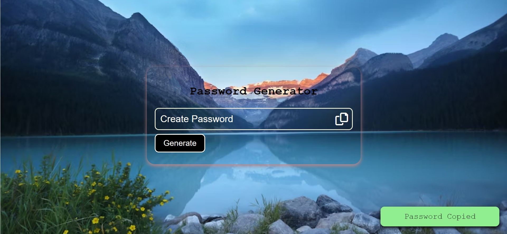

# Password-Generator
Password Generator

This is a simple password generator program that generates random passwords based on user-specified criteria such as length, 
inclusion of numbers or special characters, and more.

Technologies Used
HTML,
CSS,
and JavaScript.
Demo:https://aneal07.github.io/Password-Generator/

